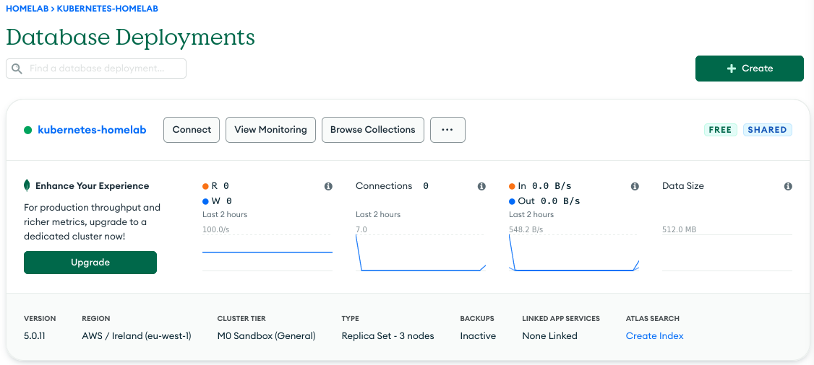

# Terraform

These resources should be built with Terraform: https://terraform.io

Create and manage a free tier Mongo Atlas M0 cluster with Terraform.

## Pre-requisites

### Install Terraform

On a Debian-based system:

```
sudo apt install -y curl
curl -fsSL https://apt.releases.hashicorp.com/gpg | sudo apt-key add -
sudo apt-add-repository "deb [arch=amd64] https://apt.releases.hashicorp.com $(lsb_release -cs) main"
sudo apt update
sudo apt install -y terraform
```

On a RHEL-based system:

```
sudo yum install -y yum-utils
sudo yum-config-manager --add-repo https://rpm.releases.hashicorp.com/RHEL/hashicorp.repo
sudo yum -y install terraform
```

### Configure AWS S3 and DynamoDB for Remote State Files

See configuration instructions here:

https://www.lisenet.com/2020/terraform-with-aws-s3-and-dynamodb-for-remote-state-files/

See required IAM account permissions [docs/terraform-aws-iam-permissions.json](./docs/terraform-aws-iam-permissions.json).

### Create API Credentials

You need MongoDB Atlas API credentials that have `Project Owner` permissions in order to deploy a cluster.

Consult MongoDB Atlas documentation for how to create them.

Terraform will read environment variables. You can set the shell to use something like this to avoid being prompted to enter the details:

```
export TF_VAR_mongo_atlas_api_public_key=example
export TF_VAR_mongo_atlas_api_private_key=example
export TF_VAR_mongo_database_admin_password=example
export TF_VAR_mongo_database_app_password=example
```

## Deployment

Requires Terraform v1.0 or above.

```
terraform init -upgrade
terraform apply
```

Retrieve Mongo Compass connection string:

```
terraform output mongo_compass_connection_string
```



## References

https://registry.terraform.io/providers/mongodb/mongodbatlas/latest/docs
